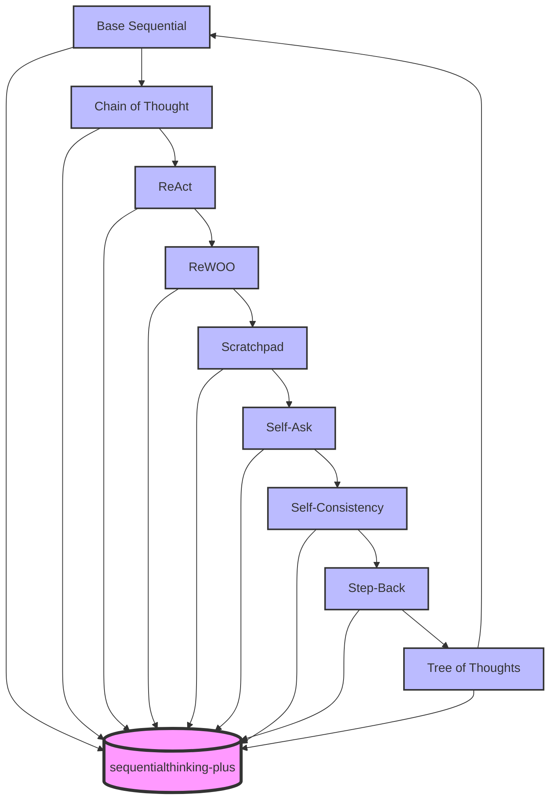

# SequentialThinking Plus MCP Server



An MCP server implementation that provides a tool for dynamic and reflective problem-solving through a structured thinking process.

## Documentation

Comprehensive documentation is available in the following files:

- [Documentation Index](./docs/SequentialThinking-Index.md) - Start here for an overview of all documentation
- [Executive Summary](./docs/SequentialThinking-ExecutiveSummary.md) - High-level overview of Sequential Thinking
- [Practical Guide](./docs/SequentialThinking-PracticalGuide.md) - Examples and best practices for using the tool
- [Technical Documentation](./docs/SequentialThinking-Documentation.md) - Detailed technical explanation of the architecture
- [Flow Engine Architecture](./docs/SequentialThinking-FlowEngine.md) - In-depth explanation of the flow engine's flexibility
- [Strategy Comparison](./docs/strategy-comparison.md) - Detailed comparison of different thinking strategies

## Features

- Break down complex problems into manageable steps
- Revise and refine thoughts as understanding deepens
- Branch into alternative paths of reasoning
- Adjust the total number of thoughts dynamically
- Support for unfixed step numbers through cyclic flows
- Strategy-specific flow patterns for different reasoning approaches
- Generate and verify solution hypotheses

## Tools and Resources

### Tool: sequentialthinking-plus

Facilitates a detailed, step-by-step thinking process for problem-solving and analysis.

**Inputs:**
- `thought` (string): The current thinking step
- `nextThoughtNeeded` (boolean): Whether another thought step is needed
- `thoughtNumber` (integer): Current thought number
- `totalThoughts` (integer): Estimated total thoughts needed
- `isRevision` (boolean, optional): Whether this revises previous thinking
- `revisesThought` (integer, optional): Which thought is being reconsidered
- `branchFromThought` (integer, optional): Branching point thought number
- `branchId` (string, optional): Branch identifier
- `needsMoreThoughts` (boolean, optional): If more thoughts are needed

### Resource: sequentialthinking-plus://documentation

Provides detailed documentation for the Sequential Thinking tool, including:
- When to use the tool
- Key features
- Parameter explanations
- Best practices for effective usage

## Usage

The Sequential Thinking tool is designed for:
- Breaking down complex problems into steps
- Planning and design with room for revision
- Analysis that might need course correction
- Problems where the full scope might not be clear initially
- Tasks that need to maintain context over multiple steps
- Situations where irrelevant information needs to be filtered out

## Installation

### Prerequisites

- Node.js (v14 or higher)
- npm (v6 or higher)

### Setup

1. Clone the repository:
```bash
git clone https://github.com/aaronsb/sequentialthinking-plus.git
cd sequentialthinking-plus
```

2. Install dependencies:
```bash
npm install
```

3. Make the server executable:
```bash
chmod +x index.js
```

4. Run the server:
```bash
node index.js
```

### Development

To contribute to the project:

1. Fork the repository on GitHub
2. Clone your fork locally
3. Add the upstream repository:
```bash
git remote add upstream https://github.com/aaronsb/sequentialthinking-plus.git
```
4. Create a branch for your changes
5. Submit a pull request with your changes

## Configuration

### Usage with Cline

Add this to your `cline_mcp_settings.json`:

```json
{
  "mcpServers": {
    "sequentialthinking-plus": {
      "autoApprove": [],
      "disabled": false,
      "timeout": 60,
      "command": "node",
      "args": [
        "/home/aaron/Projects/ai/mcp/sequentialthinking-plus/index.js"
      ],
      "env": {},
      "transportType": "stdio"
    }
  }
}
```

## License

This MCP server is licensed under the MIT License. This means you are free to use, modify, and distribute the software, subject to the terms and conditions of the MIT License.
