# Sequential Thinking: Technical Documentation

## Overview

Sequential Thinking is a Model Context Protocol (MCP) server that facilitates structured, step-by-step problem-solving through a dynamic thinking process. This documentation explains the architecture, sequence flow, and key mechanisms of the tool.

## Architecture

The Sequential Thinking server is built on the MCP framework, providing a specialized tool for breaking down complex problems into manageable steps while allowing for revisions, branching, and dynamic adjustment of the thinking process. The server also includes persistent storage for completed thinking sessions.


## Core Components

### SequentialThinkingServer

The main class that manages the thought process, including:
- Tracking thought history
- Managing branches
- Validating input
- Formatting output

### MCP Integration

The server integrates with the MCP framework through:
- Tool definition (`sequentialthinking`)
- Resource provision (`sequentialthinking://documentation`)
- Request handlers for tool calls and resource access

## Thought Processing Sequence

The following diagram illustrates the sequence of processing a thought:


## Thought Data Flow

The following diagram shows how thought data flows through the system:


## Thought Types and Transitions

The Sequential Thinking tool supports different types of thoughts and transitions between them:


## Thought Formatting

Each thought is formatted for display with visual indicators for its type:

```mermaid
flowchart TD
    Input["Thought Data"] --> TypeCheck{"Check\nThought Type"}
    
    TypeCheck -->|"Regular"| RegularFormat["Format as Regular\n💭 Thought"]
    TypeCheck -->|"Revision"| RevisionFormat["Format as Revision\n🔄 Revision"]
    TypeCheck -->|"Branch"| BranchFormat["Format as Branch\n🌿 Branch"]
    
    RegularFormat --> Border["Add Borders"]
    RevisionFormat --> Border
    BranchFormat --> Border
    
    Border --> Display["Display in Console"]
```



## Key Parameters

The tool accepts several parameters that control the thinking process:

| Parameter | Type | Required | Description |
|-----------|------|----------|-------------|
| thought | string | Yes | The current thinking step |
| nextThoughtNeeded | boolean | Yes | Whether another thought step is needed |
| thoughtNumber | integer | Yes | Current thought number |
| totalThoughts | integer | Yes | Estimated total thoughts needed |
| isRevision | boolean | No | Whether this revises previous thinking |
| revisesThought | integer | No | Which thought is being reconsidered |
| branchFromThought | integer | No | Branching point thought number |
| branchId | string | No | Branch identifier |
| needsMoreThoughts | boolean | No | If more thoughts are needed |

## Usage Patterns

### Basic Linear Thinking


### Thinking with Revision


### Thinking with Branching


### Dynamic Adjustment of Total Thoughts


## Implementation Details

### Thought Validation

The `validateThoughtData` method ensures that all required parameters are present and of the correct type:


### Thought Formatting

The `formatThought` method creates a visually distinct representation of each thought:

```mermaid
flowchart TD
    Input["Thought Data"] --> TypeCheck{"Check\nThought Type"}
    
    TypeCheck -->|"isRevision=true"| RevisionPrefix["Set Prefix:\n🔄 Revision"]
    TypeCheck -->|"branchFromThought exists"| BranchPrefix["Set Prefix:\n🌿 Branch"]
    TypeCheck -->|"Regular Thought"| RegularPrefix["Set Prefix:\n💭 Thought"]
    
    RevisionPrefix --> CreateHeader["Create Header with\nThought Number and Context"]
    BranchPrefix --> CreateHeader
    RegularPrefix --> CreateHeader
    
    CreateHeader --> CreateBorder["Create Border\nBased on Content Length"]
    CreateBorder --> FormatOutput["Format Output with\nHeader, Border, and Content"]
    FormatOutput --> Return["Return Formatted Thought"]
    
    style Return fill:#9f9,stroke:#333,stroke-width:2px
```



## Integration with MCP

The Sequential Thinking tool integrates with the MCP framework through:


## Session Storage

The Sequential Thinking tool now includes persistent storage for completed thinking sessions. When a thinking session is completed (when `nextThoughtNeeded` is set to `false`), the entire session, including all thoughts and branches, is automatically saved to disk.

### Storage Configuration

The storage location is configurable via command-line arguments:

```bash
# Default storage location (~/Documents/thinking/)
npx sequentialthinking-plus

# Custom storage location
npx sequentialthinking-plus --storage-path /path/to/custom/storage
# or
npx sequentialthinking-plus -s /path/to/custom/storage
```

### Session Data Structure

Each session is stored in its own directory with a unique session ID based on the timestamp. The session data is saved as a JSON file with the following structure:

```json
{
  "id": "session-20250428-145302",
  "timestamp": "2025-04-28T14:53:02.123Z",
  "thoughtHistory": [
    {
      "thought": "First thought content",
      "thoughtNumber": 1,
      "totalThoughts": 3,
      "nextThoughtNeeded": true,
      "isRevision": false
    },
    {
      "thought": "Second thought content",
      "thoughtNumber": 2,
      "totalThoughts": 3,
      "nextThoughtNeeded": true,
      "isRevision": false
    },
    {
      "thought": "Final thought content",
      "thoughtNumber": 3,
      "totalThoughts": 3,
      "nextThoughtNeeded": false,
      "isRevision": false
    }
  ],
  "branches": {
    "branch-1": [
      {
        "thought": "Alternative approach",
        "thoughtNumber": 1,
        "totalThoughts": 2,
        "nextThoughtNeeded": true,
        "branchFromThought": 2,
        "branchId": "branch-1"
      }
    ]
  }
}
```

### Storage Flow


## Conclusion

The Sequential Thinking tool provides a powerful framework for structured problem-solving that can adapt to the complexity of the problem at hand. By supporting revisions, branching, dynamic adjustment of the thinking process, and persistent storage of completed sessions, it enables more effective, flexible, and reusable reasoning.
