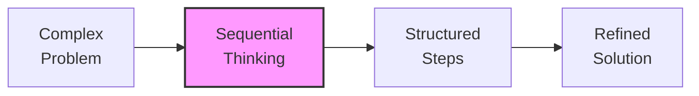
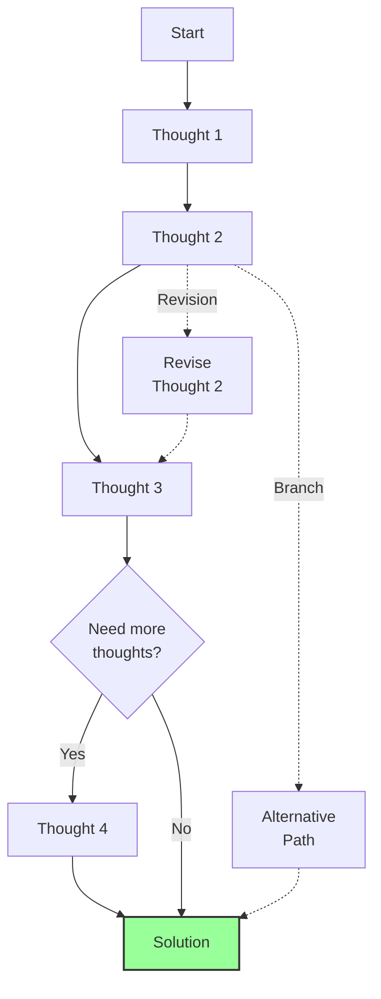
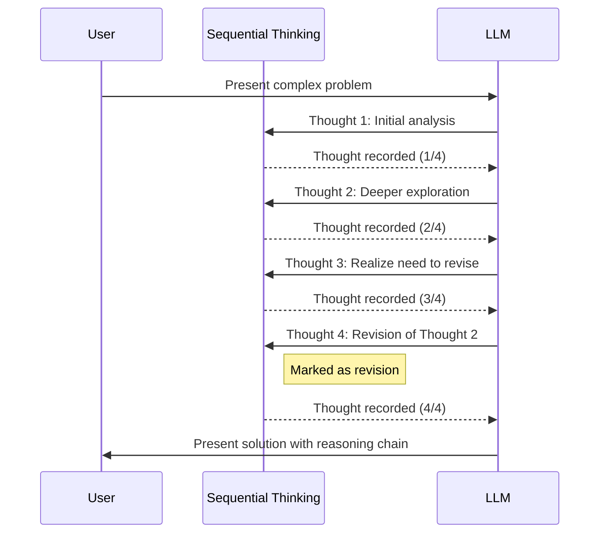

# Sequential Thinking: Executive Summary

## What is Sequential Thinking?

Sequential Thinking is a structured problem-solving tool that helps break down complex problems into manageable steps. It provides a framework for dynamic, adaptable thinking that can evolve as understanding deepens.

## Core Concept



Sequential Thinking allows you to:
- Break down complex problems into clear steps
- Revise your thinking as new insights emerge
- Explore alternative paths through branching
- Adjust the scope dynamically as needed

## How It Works



Each thought in the sequence:
1. Builds on previous insights
2. Can be revised if needed
3. Can branch into alternative paths
4. Is visually formatted for clarity

## Key Benefits

- **Structured Approach**: Provides a clear framework for tackling complex problems
- **Adaptability**: Allows thinking to evolve as understanding deepens
- **Visibility**: Makes the thinking process explicit and traceable
- **Flexibility**: Supports revisions and alternative paths

## When to Use Sequential Thinking

- Complex problem-solving
- Planning and design tasks
- Analysis requiring multiple steps
- Situations where the full scope may not be clear initially
- Problems that might need course correction

## Example: Simple Problem-Solving Flow



## Visual Representation of Thoughts

Each thought is visually formatted with:
- Type indicator (regular, revision, or branch)
- Progress tracking (current/total)
- Clear borders for readability

```
┌─────────────────────────────────────┐
│ 💭 Thought 1/4                      │
├─────────────────────────────────────┤
│ Initial analysis of the problem...  │
└─────────────────────────────────────┘

┌─────────────────────────────────────┐
│ 🔄 Revision 4/4 (revising thought 2) │
├─────────────────────────────────────┤
│ Better approach based on new data... │
└─────────────────────────────────────┘
```

## Integration

Sequential Thinking is implemented as an MCP (Model Context Protocol) server, making it easy to integrate with AI systems and other tools in your workflow.

## Conclusion

Sequential Thinking provides a powerful framework for structured problem-solving that adapts to the complexity of the task at hand. By making the thinking process explicit and supporting revisions and branching, it enables more effective reasoning and problem-solving.
