# Sequential Thinking: Flow Engine Architecture

## Overview

The Sequential Thinking Flow Engine is the core component that enables flexible, dynamic thinking processes across different reasoning strategies. This document explains how the engine supports unfixed step numbers, branching approaches, and strategy-specific flows.

## Flow Engine Architecture

The Flow Engine is built around a stage-based transition system that allows for both structured progression and flexible adaptation based on the needs of the problem-solving process.

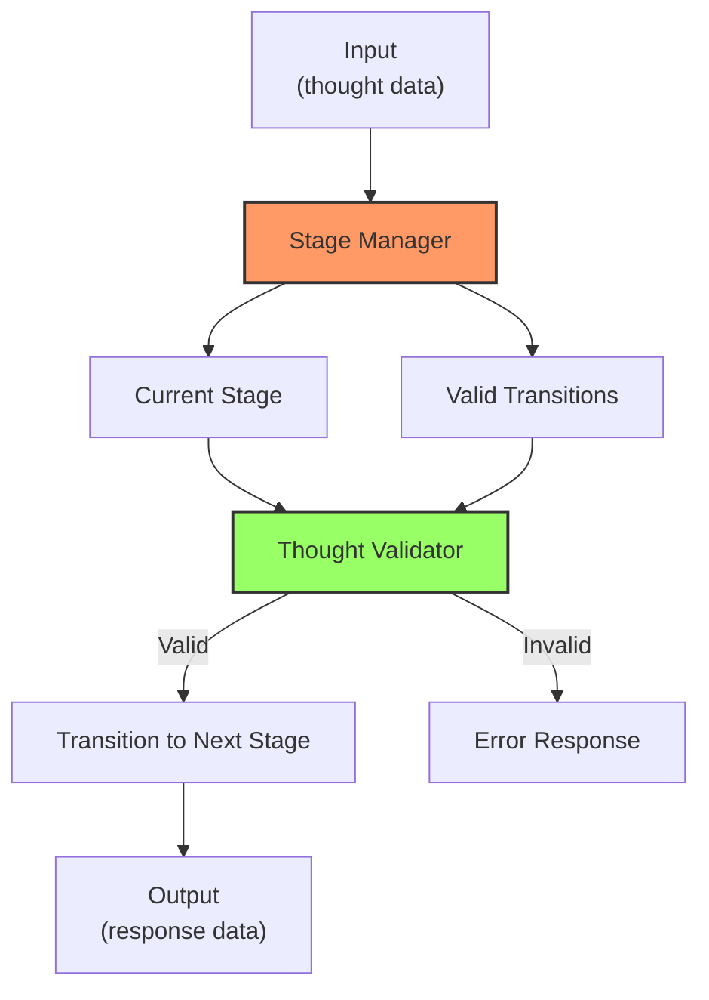

## Unfixed Step Numbers

The Flow Engine supports unfixed step numbers through several mechanisms:

### 1. Cyclic Stage Transitions

Many strategies include stages that can transition back to previous stages, creating cycles that allow for repeating steps as needed:

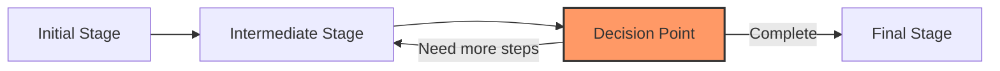

For example, in the ReAct strategy:
- After observing results (observation_reception)
- The reasoning is updated (reasoning_update)
- At the evaluation checkpoint, the flow can either:
  - Return to action_planning for more actions
  - Proceed to solution_formulation when sufficient information is gathered

### 2. Dynamic Thought Count Adjustment

The engine allows for adjusting the total number of thoughts during the process:

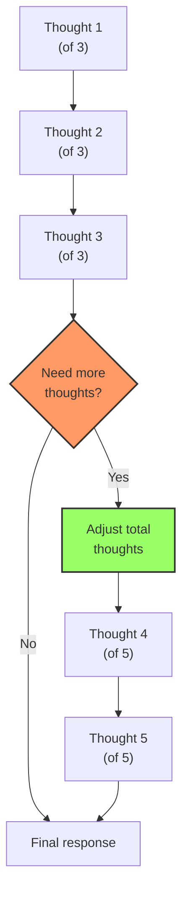

This is implemented through:
- The `continuation_decision` stage in multiple strategies
- Automatic adjustment of `totalThoughts` if `thoughtNumber > totalThoughts`
- The `needsMoreThoughts` parameter to explicitly signal adjustment

### 3. Strategy-Specific Iteration Points

Different strategies have specific stages designed for iteration:

| Strategy | Iteration Point | Mechanism |
|----------|----------------|-----------|
| Base Sequential | continuation_decision | Can lead back to thought_generation via thought_adjustment |
| ReAct | evaluation_checkpoint | Can cycle back to action_planning |
| Scratchpad | continuation_decision | Can return to iterative_calculation |
| Self-Ask | completion_check | Can generate more sub_question_formulation steps |
| Tree of Thoughts | continuation_decision | Can lead to more branch_development or branch_creation |

## Branching Approaches

The Flow Engine supports branching through dedicated mechanisms:

### 1. Explicit Branch Tracking

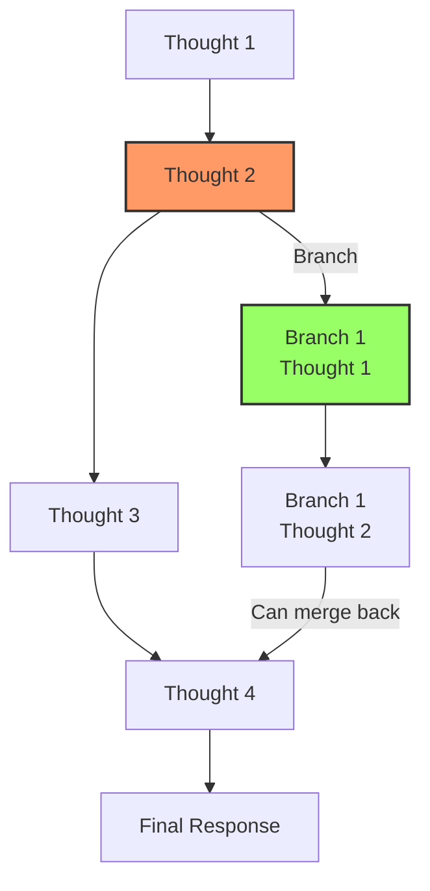

This is implemented through:
- The `branches` object in the SequentialThinkingServer class
- The `branchFromThought` and `branchId` parameters in the schema
- Special handling in the `processThought` method

### 2. Strategy-Specific Branching

Some strategies are explicitly designed for branching:

#### Tree of Thoughts
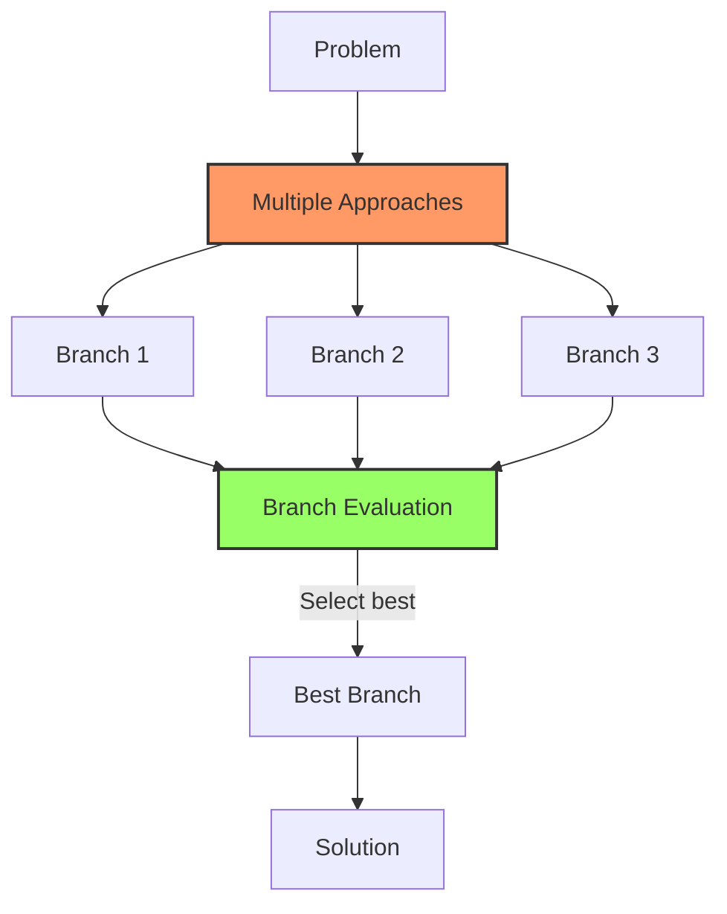

#### Self-Consistency
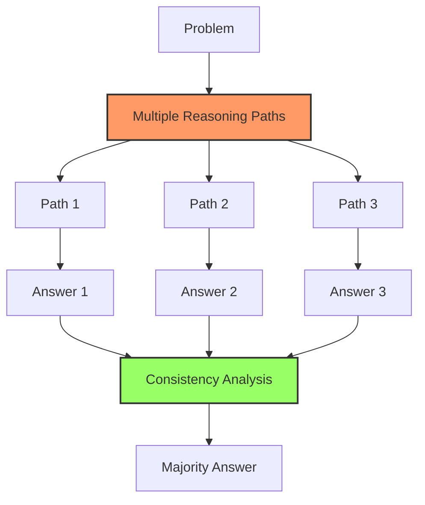

### 3. Branch Creation and Selection

The flow engine supports:
- Creating branches from any thought
- Developing multiple branches in parallel
- Evaluating branches based on promise or feasibility
- Selecting the most promising branch(es) to continue

## Strategy-Specific Flow Patterns

Each strategy has its own flow pattern defined in the `stageTransitions` configuration:

### Base Sequential
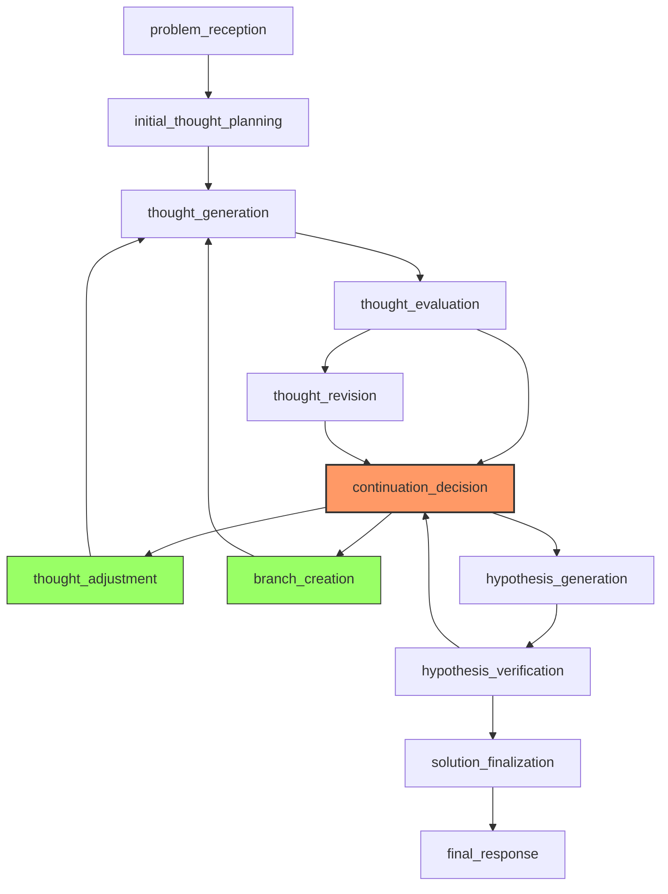

### Chain of Thought
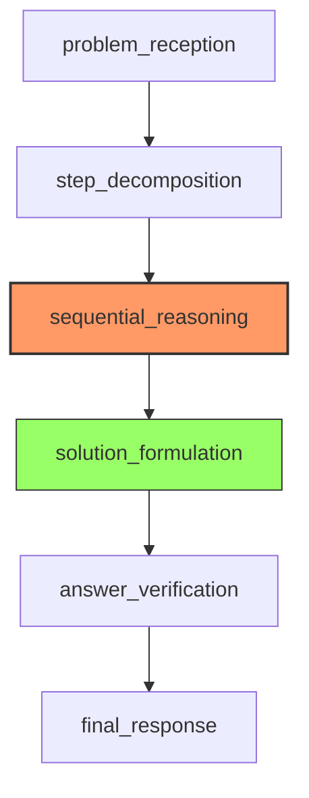

### ReAct
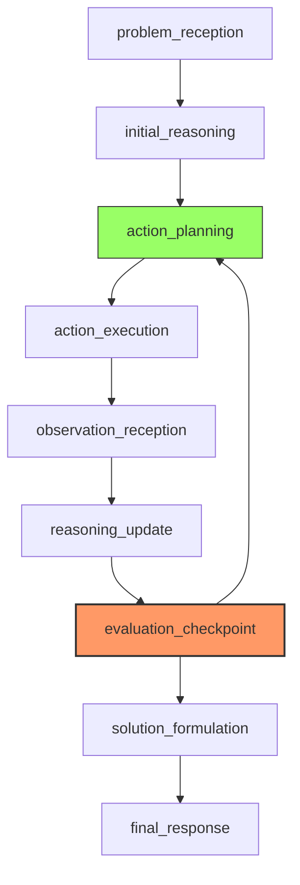

### ReWOO
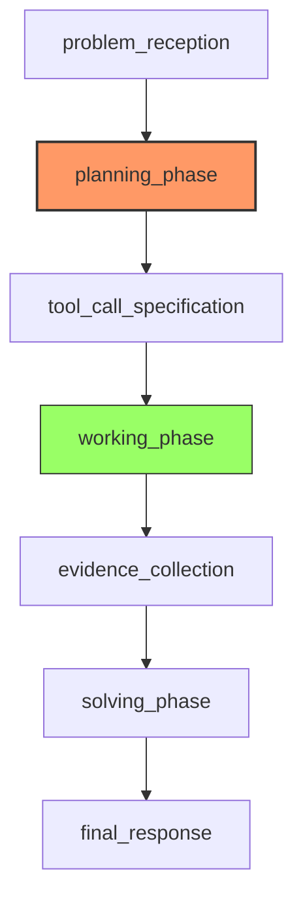

### Scratchpad
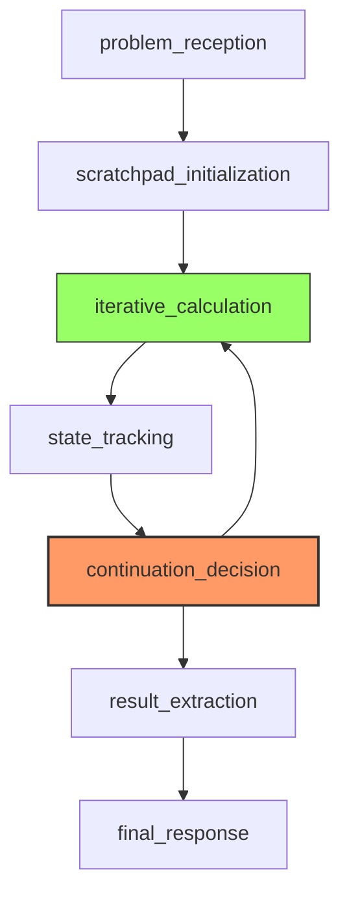

### Self-Ask
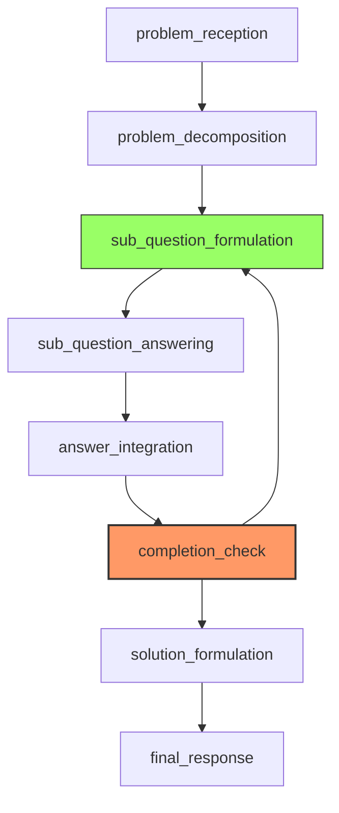

### Self-Consistency
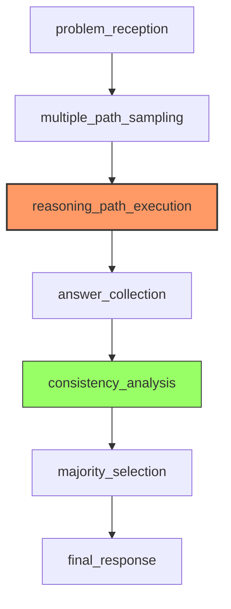

### Step-Back
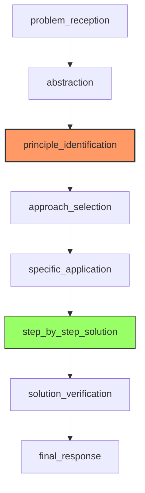

### Tree of Thoughts
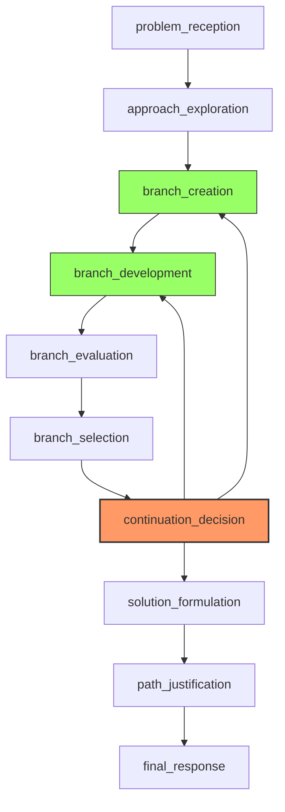

## Implementation Details

### Stage Manager

The `StageManager` class is responsible for:
- Tracking the current stage
- Validating stage transitions
- Providing stage-specific prompts and required parameters

```javascript
class StageManager {
    constructor(strategy) {
        this.strategy = strategy;
        this.stages = strategyConfig.strategyStages[strategy] || [];
        this.transitions = strategyConfig.stageTransitions[strategy] || {};
        this.descriptions = strategyConfig.stageDescriptions || {};
        this.currentStage = this.stages[0] || null;
        this.stageHistory = [];
    }

    // Gets valid next stages from the current stage
    getNextStages() {
        return this.transitions[this.currentStage] || [];
    }

    // Validates if a transition is allowed
    canTransitionTo(nextStage) {
        const validNextStages = this.getNextStages();
        return validNextStages.includes(nextStage);
    }

    // Performs the transition if valid
    transitionTo(nextStage) {
        if (!this.canTransitionTo(nextStage)) {
            throw new Error(`Invalid transition from ${this.currentStage} to ${nextStage}`);
        }
        this.stageHistory.push(this.currentStage);
        this.currentStage = nextStage;
        return this.currentStage;
    }
}
```

### Stage Transitions Configuration

The stage transitions are defined in the `stageTransitions` object in the strategy-stages-mapping.json file:

```json
"stageTransitions": {
  "linear": {
    "problem_reception": ["initial_thought_planning"],
    "initial_thought_planning": ["thought_generation"],
    "thought_generation": ["thought_evaluation"],
    "thought_evaluation": ["thought_revision", "continuation_decision"],
    "thought_revision": ["continuation_decision"],
    "continuation_decision": ["thought_adjustment", "branch_creation", "hypothesis_generation"],
    "thought_adjustment": ["thought_generation"],
    "branch_creation": ["thought_generation"],
    "hypothesis_generation": ["hypothesis_verification"],
    "hypothesis_verification": ["solution_finalization", "continuation_decision"],
    "solution_finalization": ["final_response"],
    "final_response": []
  },
  // Other strategies...
}
```

This configuration defines which stages can follow the current stage, enabling:
- Linear progression (single next stage)
- Decision points (multiple possible next stages)
- Cycles (transitions back to previous stages)
- Branching (transitions to different paths)

## Practical Examples

### Example 1: ReAct Cyclic Flow

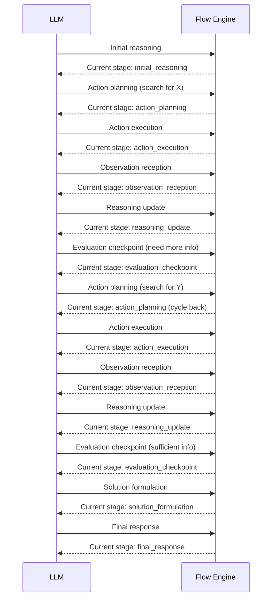

### Example 2: Tree of Thoughts Branching

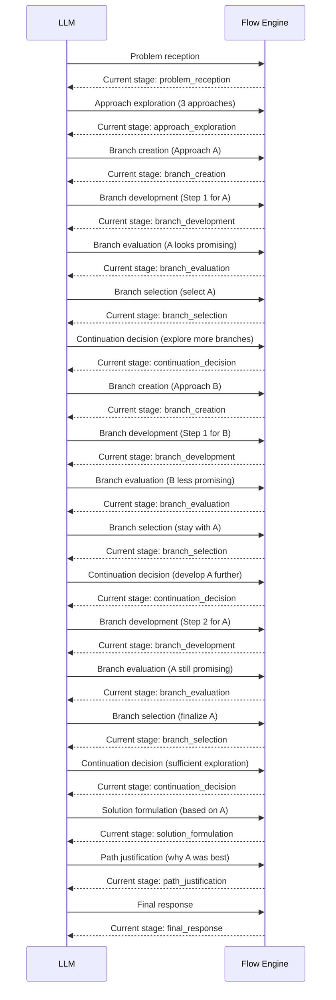

## Conclusion

The Sequential Thinking Flow Engine provides a flexible framework that supports:

1. **Unfixed Step Numbers**:
   - Through cyclic stage transitions
   - Dynamic thought count adjustment
   - Strategy-specific iteration points

2. **Branching Approaches**:
   - Explicit branch tracking
   - Strategy-specific branching mechanisms
   - Branch creation, development, and selection

3. **Strategy-Specific Flows**:
   - Each strategy has its own defined flow pattern
   - Customized stage transitions for different reasoning approaches
   - Specialized stages for different problem-solving techniques

This flexibility allows the Sequential Thinking tool to adapt to a wide range of problem types and complexity levels, making it a powerful framework for structured, dynamic problem-solving.
