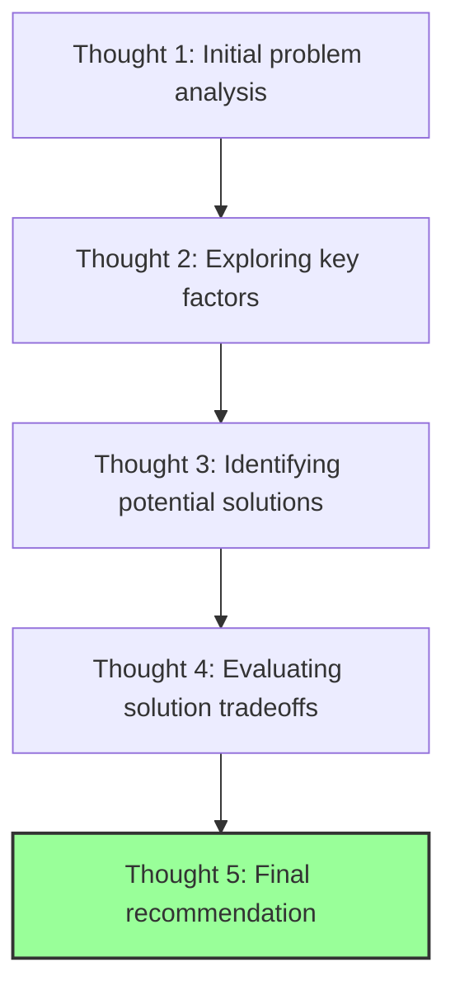
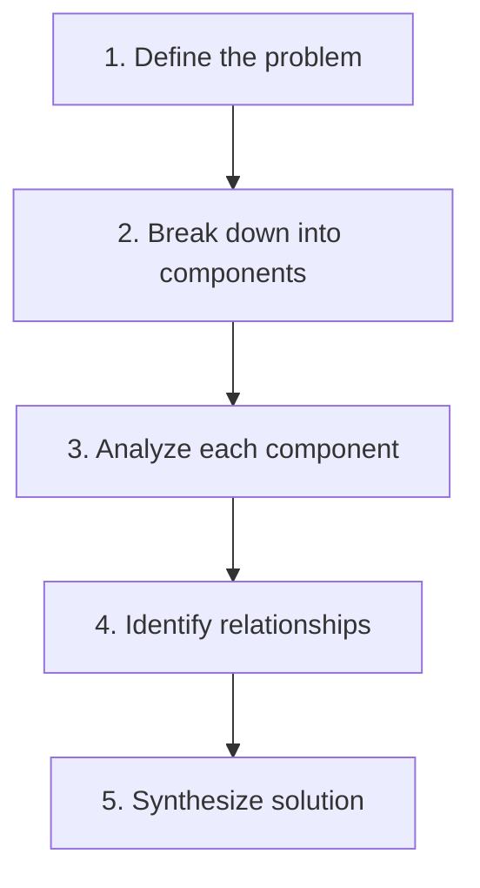
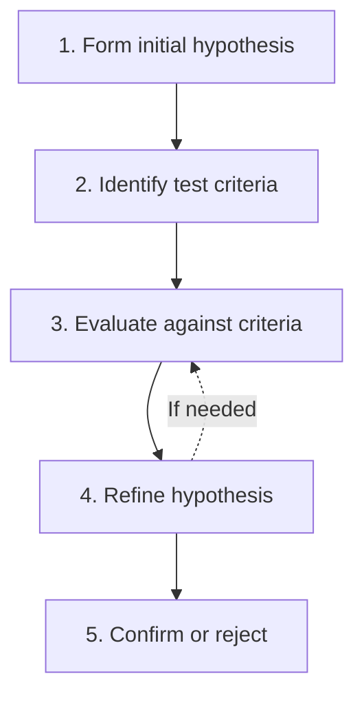
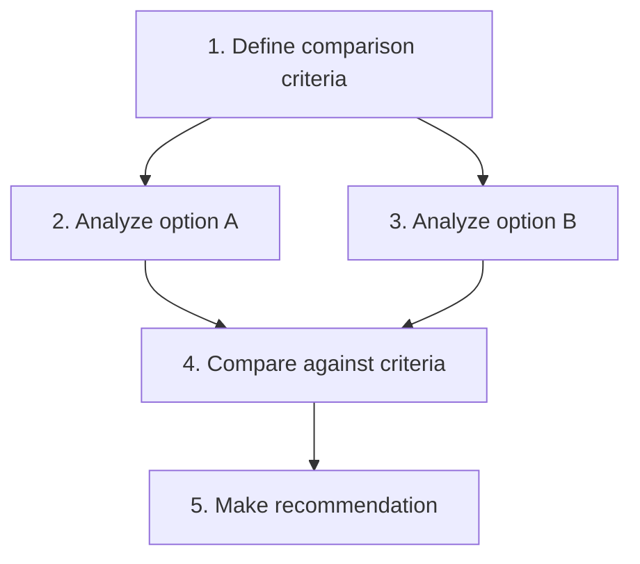
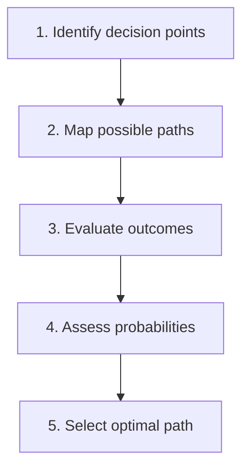

# Sequential Thinking: Practical Guide

This guide provides practical examples and best practices for using the Sequential Thinking tool effectively.

## Getting Started

### Basic Usage Pattern

```javascript
// Example of using the sequentialthinking tool
const result = await useSequentialThinking({
  thought: "My first analytical step in solving this problem...",
  thoughtNumber: 1,
  totalThoughts: 5,  // Initial estimate
  nextThoughtNeeded: true
});
```

### Complete Thought Sequence Example



## Example Scenarios

### Scenario 1: Solving a Logic Puzzle

```
┌───────────────────────────────────────────────────────────┐
│ 💭 Thought 1/4                                            │
├───────────────────────────────────────────────────────────┤
│ The puzzle involves 5 houses with different colors,       │
│ owners, pets, drinks, and cigarette brands. Let me start  │
│ by listing all the clues and organizing the information.  │
└───────────────────────────────────────────────────────────┘

┌───────────────────────────────────────────────────────────┐
│ 💭 Thought 2/4                                            │
├───────────────────────────────────────────────────────────┤
│ From the clues, I can establish some definite relations:  │
│ - The Brit lives in the red house                         │
│ - The Swede keeps dogs                                    │
│ - The Dane drinks tea                                     │
│ Let me create a grid to track all possible combinations.  │
└───────────────────────────────────────────────────────────┘

┌───────────────────────────────────────────────────────────┐
│ 🔄 Revision 3/4 (revising thought 2)                      │
├───────────────────────────────────────────────────────────┤
│ I made a mistake in my analysis. The clue actually states │
│ that the Brit lives in a red house, not necessarily that  │
│ all red houses are occupied by Brits. Let me revise my    │
│ grid and constraints accordingly.                         │
└───────────────────────────────────────────────────────────┘

┌───────────────────────────────────────────────────────────┐
│ 💭 Thought 4/4                                            │
├───────────────────────────────────────────────────────────┤
│ After applying all constraints and logical deductions,    │
│ I can determine that the German owns the fish. This       │
│ solves the puzzle's main question of "who owns the fish." │
└───────────────────────────────────────────────────────────┘
```

### Scenario 2: Software Architecture Design with Branching

```
┌───────────────────────────────────────────────────────────┐
│ 💭 Thought 1/6                                            │
├───────────────────────────────────────────────────────────┤
│ For this web application, we need to decide on the        │
│ architecture. Let's consider the requirements: high       │
│ scalability, real-time updates, and complex data          │
│ processing. A microservices architecture might be         │
│ appropriate given these requirements.                     │
└───────────────────────────────────────────────────────────┘

┌───────────────────────────────────────────────────────────┐
│ 💭 Thought 2/6                                            │
├───────────────────────────────────────────────────────────┤
│ For the microservices approach, we would need:            │
│ - API Gateway for client requests                         │
│ - User Service for authentication and profiles            │
│ - Data Processing Service for complex calculations        │
│ - Notification Service for real-time updates              │
│ - Database Service for data persistence                   │
└───────────────────────────────────────────────────────────┘

┌───────────────────────────────────────────────────────────┐
│ 🌿 Branch 3/6 (from thought 1, ID: alt-monolith)          │
├───────────────────────────────────────────────────────────┤
│ Let's explore an alternative: a monolithic architecture   │
│ with careful module separation. This might be simpler to  │
│ implement initially and could be refactored later if      │
│ needed. The monolith would include all functionality but  │
│ with clear boundaries between components.                 │
└───────────────────────────────────────────────────────────┘

┌───────────────────────────────────────────────────────────┐
│ 🌿 Branch 4/6 (from thought 3, ID: alt-monolith)          │
├───────────────────────────────────────────────────────────┤
│ The monolithic approach would be structured as:           │
│ - Core module with shared functionality                   │
│ - User module for auth and profiles                       │
│ - Processing module for calculations                      │
│ - Notification module using WebSockets                    │
│ - Database access layer with clear separation             │
└───────────────────────────────────────────────────────────┘

┌───────────────────────────────────────────────────────────┐
│ 💭 Thought 5/6                                            │
├───────────────────────────────────────────────────────────┤
│ After comparing both approaches:                          │
│ - Microservices offer better scalability and isolation    │
│ - Monolith offers simpler initial development             │
│ - Team size and experience favor a monolithic approach    │
│ - Future growth expectations suggest eventual migration   │
│   to microservices                                        │
└───────────────────────────────────────────────────────────┘

┌───────────────────────────────────────────────────────────┐
│ 💭 Thought 6/6                                            │
├───────────────────────────────────────────────────────────┤
│ Final recommendation: Start with a well-structured        │
│ monolith with clear module boundaries designed for        │
│ future extraction into microservices. This provides a     │
│ balance between immediate development efficiency and      │
│ long-term scalability needs.                              │
└───────────────────────────────────────────────────────────┘
```

### Scenario 3: Dynamic Adjustment of Thought Count

```
┌───────────────────────────────────────────────────────────┐
│ 💭 Thought 1/3                                            │
├───────────────────────────────────────────────────────────┤
│ Initial analysis of the market trends shows increasing    │
│ demand for sustainable products in this sector.           │
└───────────────────────────────────────────────────────────┘

┌───────────────────────────────────────────────────────────┐
│ 💭 Thought 2/3                                            │
├───────────────────────────────────────────────────────────┤
│ Competitor analysis reveals three major players with      │
│ similar offerings but weak sustainability messaging.      │
└───────────────────────────────────────────────────────────┘

┌───────────────────────────────────────────────────────────┐
│ 💭 Thought 3/3                                            │
├───────────────────────────────────────────────────────────┤
│ I realize we need more analysis before making a           │
│ recommendation. We should also examine pricing strategies │
│ and distribution channels. Let me adjust the total        │
│ thoughts needed from 3 to 5.                              │
└───────────────────────────────────────────────────────────┘

┌───────────────────────────────────────────────────────────┐
│ 💭 Thought 4/5                                            │
├───────────────────────────────────────────────────────────┤
│ Price analysis shows our sustainable option can command   │
│ a 15-20% premium while remaining competitive due to       │
│ increasing consumer willingness to pay for sustainability.│
└───────────────────────────────────────────────────────────┘

┌───────────────────────────────────────────────────────────┐
│ 💭 Thought 5/5                                            │
├───────────────────────────────────────────────────────────┤
│ Recommendation: Launch the sustainable product line with  │
│ strong environmental messaging, a 15% price premium, and  │
│ distribution through specialty retailers first, followed  │
│ by mainstream channels in phase two.                      │
└───────────────────────────────────────────────────────────┘
```

### Scenario 4: Trilemma Strategy - Balancing Competing Objectives

The trilemma strategy is designed for situations requiring satisficing balance between three competing objectives that cannot all be maximized simultaneously.

```
┌───────────────────────────────────────────────────────────┐
│ 💭 Thought 1/8 [trilemma] [Stage: problem_reception]      │
├───────────────────────────────────────────────────────────┤
│ Planning a product launch with three competing objectives:│
│ - FAST: Launch within 3 months                           │
│ - CHEAP: Stay under $100K budget                         │
│ - GOOD: Achieve high quality standards                    │
│ These objectives conflict - rushing reduces quality,      │
│ quality costs money, saving money takes time.            │
└───────────────────────────────────────────────────────────┘

┌───────────────────────────────────────────────────────────┐
│ 💭 Thought 2/8 [trilemma] [Stage: objective_initialization]│
├───────────────────────────────────────────────────────────┤
│ Setting up measurable thresholds:                        │
│ - FAST: Score 0.7 threshold (launch by month 4 latest)   │
│ - CHEAP: Score 0.6 threshold (max $120K acceptable)      │
│ - GOOD: Score 0.5 threshold (min viable quality)         │
│ Current scores: FAST: 0.9, CHEAP: 0.3, GOOD: 0.8         │
│ Budget is severely constrained!                          │
└───────────────────────────────────────────────────────────┘

┌───────────────────────────────────────────────────────────┐
│ 💭 Thought 3/8 [trilemma] [Stage: trade_off_evaluation]   │
├───────────────────────────────────────────────────────────┤
│ Evaluating trade-offs:                                    │
│ - Delaying 1 month saves $30K (helps CHEAP, hurts FAST)  │
│ - Reducing features saves $40K (helps CHEAP, hurts GOOD) │
│ - Outsourcing QA saves time (helps FAST, hurts budget)   │
│ Need to find creative compromises...                     │
└───────────────────────────────────────────────────────────┘

┌───────────────────────────────────────────────────────────┐
│ 💭 Thought 4/8 [trilemma] [Stage: satisficing_iteration]  │
├───────────────────────────────────────────────────────────┤
│ Iteration 1: Phased launch approach                      │
│ - Core features in 3.5 months (FAST: 0.7)               │
│ - MVP scope reduces cost (CHEAP: 0.55)                   │
│ - Focus QA on critical paths (GOOD: 0.6)                │
│ Still below CHEAP threshold, need more adjustments...    │
└───────────────────────────────────────────────────────────┘

┌───────────────────────────────────────────────────────────┐
│ 💭 Thought 5/8 [trilemma] [Stage: propagation_decision]   │
├───────────────────────────────────────────────────────────┤
│ Propagating solution forward with new insight:           │
│ Found a partnership opportunity that provides:           │
│ - Shared marketing costs (saves $25K)                    │
│ - Access to their QA team (maintains quality)            │
│ - Must accommodate their timeline (slight delay)         │
└───────────────────────────────────────────────────────────┘

┌───────────────────────────────────────────────────────────┐
│ 💭 Thought 6/8 [trilemma] [Stage: satisficing_iteration]  │
├───────────────────────────────────────────────────────────┤
│ Iteration 2: Partnership model                           │
│ - Launch in month 4 with partner (FAST: 0.65)           │
│ - Total cost $95K with sharing (CHEAP: 0.75)            │
│ - Partner QA maintains standards (GOOD: 0.7)             │
│ All objectives now meet thresholds!                      │
└───────────────────────────────────────────────────────────┘

┌───────────────────────────────────────────────────────────┐
│ 💭 Thought 7/8 [trilemma] [Stage: equilibrium_check]      │
├───────────────────────────────────────────────────────────┤
│ Equilibrium reached:                                      │
│ ✓ FAST: 0.65 > 0.7 threshold ❌ (Just missed!)          │
│ ✓ CHEAP: 0.75 > 0.6 threshold ✓                        │
│ ✓ GOOD: 0.7 > 0.5 threshold ✓                          │
│ Need minor adjustment to meet FAST threshold...          │
└───────────────────────────────────────────────────────────┘

┌───────────────────────────────────────────────────────────┐
│ 💭 Thought 8/8 [trilemma] [Stage: final_balance]         │
├───────────────────────────────────────────────────────────┤
│ Final solution: Hybrid approach                          │
│ - Soft launch key features month 3.5 (FAST: 0.7 ✓)      │
│ - Full launch with partner month 4                      │
│ - Total cost $98K (CHEAP: 0.68 ✓)                      │
│ - Maintained quality standards (GOOD: 0.65 ✓)           │
│ Successfully balanced all three objectives!              │
└───────────────────────────────────────────────────────────┘
```

#### Key Trilemma Concepts:

**Satisficing vs Optimizing**: The trilemma strategy acknowledges that real-world problems often require "good enough" solutions across multiple dimensions rather than perfection in any single one.

**Trade-off Matrix**: Understanding how improving one objective affects others is crucial:
```javascript
tradeOffMatrix: [
  {improving: "fast", affecting: "good", impact: -0.8},
  {improving: "fast", affecting: "cheap", impact: -0.3},
  {improving: "cheap", affecting: "good", impact: -0.6},
  {improving: "cheap", affecting: "fast", impact: -0.4},
  {improving: "good", affecting: "fast", impact: -0.7},
  {improving: "good", affecting: "cheap", impact: -0.9}
]
```

**Iterative Refinement**: The strategy uses multiple iterations to explore different configurations until all objectives meet their minimum thresholds.

## Best Practices

### 1. Start with a Reasonable Estimate

Begin with a reasonable estimate of how many thoughts you'll need, but be prepared to adjust:

```javascript
// Good initial approach
{
  thought: "First step in analysis...",
  thoughtNumber: 1,
  totalThoughts: 5,  // Reasonable starting estimate
  nextThoughtNeeded: true
}
```

### 2. Use Revisions Effectively

When you realize a previous thought needs correction:

```javascript
// Effective revision
{
  thought: "After reviewing the data again, I see that my conclusion in thought 2 was incorrect...",
  thoughtNumber: 4,
  totalThoughts: 6,
  nextThoughtNeeded: true,
  isRevision: true,
  revisesThought: 2
}
```

### 3. Create Meaningful Branches

When exploring alternative approaches:

```javascript
// Effective branching
{
  thought: "Let's explore an alternative solution approach...",
  thoughtNumber: 3,
  totalThoughts: 7,
  nextThoughtNeeded: true,
  branchFromThought: 2,
  branchId: "alternative-solution"
}
```

### 4. Signal Completion Clearly

When you've reached a conclusion:

```javascript
// Clear completion
{
  thought: "Based on all the analysis, the final recommendation is...",
  thoughtNumber: 7,
  totalThoughts: 7,
  nextThoughtNeeded: false  // Signals this is the final thought
}
```

### 5. Adjust Thought Count When Needed

When you realize you need more thoughts:

```javascript
// Adjusting thought count
{
  thought: "I need to explore additional factors before concluding...",
  thoughtNumber: 5,
  totalThoughts: 8,  // Increased from original estimate of 5
  nextThoughtNeeded: true,
  needsMoreThoughts: true
}
```

## Common Patterns

### Problem Decomposition Pattern



### Hypothesis Testing Pattern



### Comparative Analysis Pattern



### Decision Tree Pattern



## Anti-Patterns to Avoid

### 1. Premature Conclusion

```javascript
// Avoid this pattern
{
  thought: "Based on limited analysis, I'll conclude that...",
  thoughtNumber: 2,
  totalThoughts: 2,  // Too few thoughts for complex problems
  nextThoughtNeeded: false
}
```

### 2. Unfocused Thoughts

```javascript
// Avoid this pattern
{
  thought: "Here are many unrelated observations about various aspects of the problem without clear focus...",
  thoughtNumber: 3,
  totalThoughts: 5,
  nextThoughtNeeded: true
}
```

### 3. Ignoring Previous Errors

```javascript
// Avoid this pattern
{
  thought: "Continuing with my analysis despite noticing errors in my previous reasoning...",
  thoughtNumber: 4,
  totalThoughts: 5,
  nextThoughtNeeded: true
  // Should use isRevision: true here
}
```

### 4. Excessive Branching

```javascript
// Avoid this pattern
{
  thought: "Let me explore yet another alternative approach...",
  thoughtNumber: 7,
  totalThoughts: 10,
  nextThoughtNeeded: true,
  branchFromThought: 2,
  branchId: "fourth-alternative"  // Too many branches without synthesis
}
```

## Tips for Specific Problem Types

### For Complex Technical Problems

1. Start with a clear problem statement
2. Break down into technical components
3. Analyze dependencies between components
4. Consider constraints and requirements
5. Evaluate technical tradeoffs
6. Synthesize a solution that balances all factors

### For Decision-Making Problems

1. Define the decision criteria clearly
2. Identify all viable options
3. Evaluate each option against criteria
4. Consider risks and uncertainties
5. Make a recommendation with clear rationale

### For Creative Problems

1. Define the creative challenge
2. Explore multiple perspectives
3. Generate diverse ideas (use branching)
4. Evaluate ideas against objectives
5. Refine and develop the most promising ideas
6. Present final creative solution

### For Trilemma Problems (Three-Way Trade-offs)

1. **Identify the three competing objectives** - Be specific and measurable
2. **Set realistic thresholds** - Define minimum acceptable levels for each
3. **Map the trade-offs** - Understand how improving one affects others
4. **Iterate toward balance** - Use multiple iterations to find equilibrium
5. **Accept satisficing** - Recognize that perfection in all three is impossible
6. **Document the compromise** - Clearly explain why the balance works

Example trilemma use cases:
- Project Management: Speed vs Quality vs Cost
- System Design: Performance vs Scalability vs Maintainability
- Policy Making: Economic Growth vs Environmental Protection vs Social Equity
- Product Development: Features vs Timeline vs Budget

## Integration with Other Tools

Sequential Thinking works well in combination with:

- Structured data analysis tools
- Visualization libraries
- Project management frameworks
- Decision support systems

## Conclusion

The Sequential Thinking tool provides a powerful framework for structured problem-solving. By following the patterns and best practices in this guide, you can effectively break down complex problems, explore alternatives, revise your thinking as needed, and arrive at well-reasoned solutions.

Remember that the key strength of Sequential Thinking is its flexibility—you can adjust your approach as you gain new insights, ensuring that your thinking process adapts to the unique challenges of each problem.
