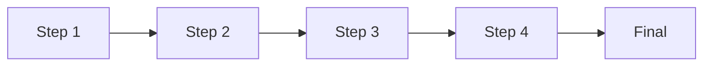
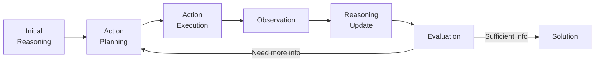
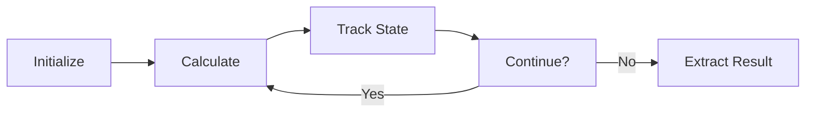
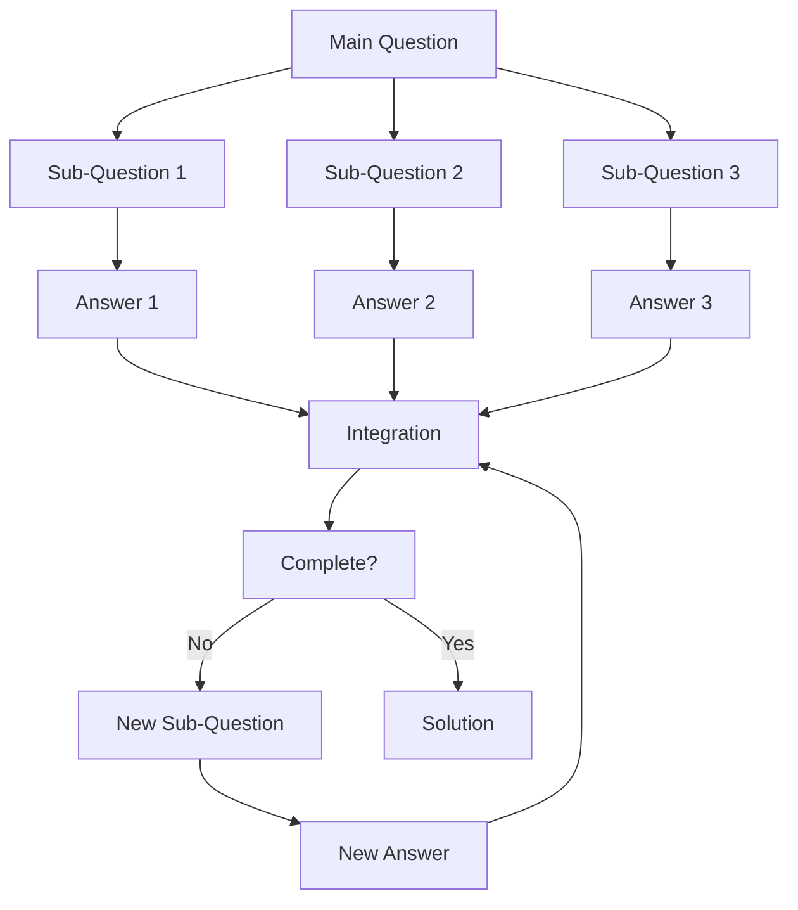
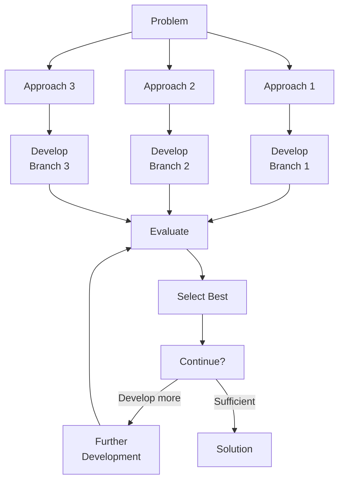
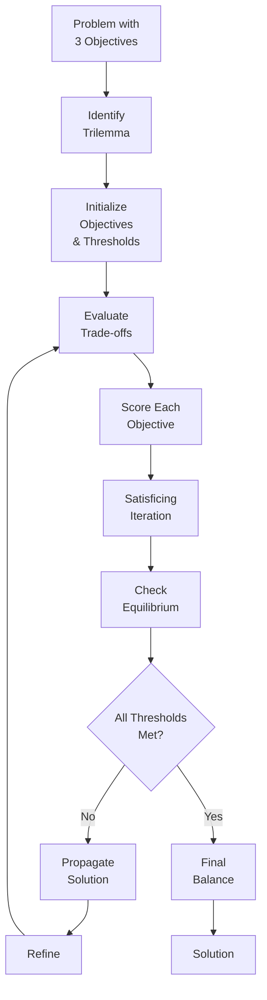
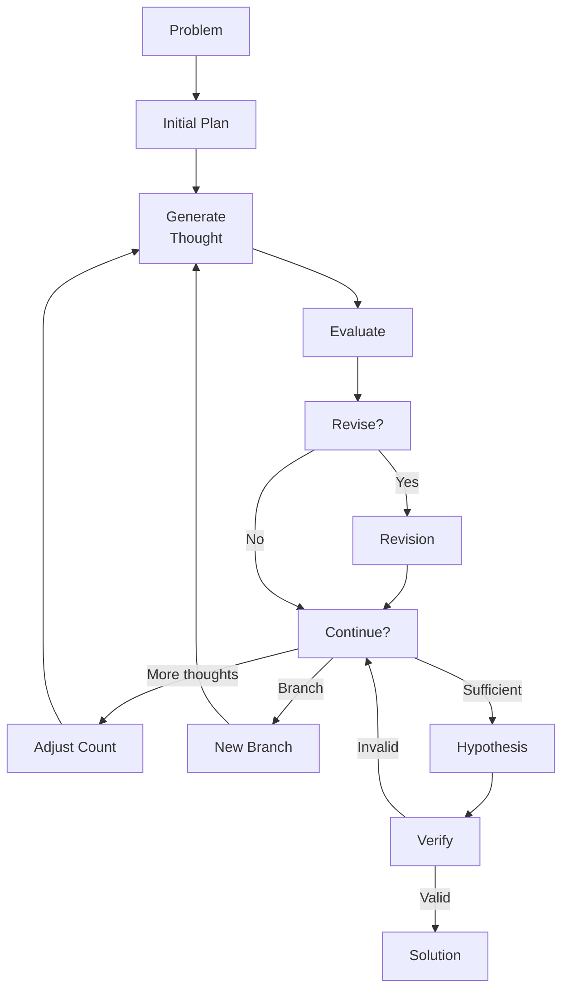

# Sequential Thinking Strategies Comparison

## Key Characteristics by Strategy

| Strategy | Flow Pattern | External Tools | Multiple Paths | Revision/Backtracking | Unfixed Step Support | Unique Features |
|----------|--------------|----------------|----------------|------------------------|---------------------|----------------|
| **Chain of Thought (CoT)** | Linear | No | No | No | No | Simple step-by-step reasoning |
| **ReAct** | Cyclic | Yes | No | Yes | Yes - via evaluation_checkpoint | Interleaves reasoning with external actions; can repeat action-observation cycles |
| **ReWOO** | Modular | Yes | No | No | No | Separates planning from execution; parallel tool calls |
| **Scratchpad** | Iterative | No | No | Yes | Yes - via continuation_decision | State tracking; program-like environment; repeatable calculation steps |
| **Self-Ask** | Hierarchical | No | No | Yes | Yes - via completion_check | Question decomposition; sub-question hierarchy; dynamic sub-question generation |
| **Self-Consistency** | Parallel | No | Yes | No | No | Multiple reasoning paths; majority voting |
| **Step-Back** | Hierarchical | No | No | Yes | No | Abstract principles before specific solution |
| **Tree of Thoughts** | Branching | No | Yes | Yes | Yes - via continuation_decision | Multiple approaches with evaluation and pruning; branch creation and selection |
| **Trilemma** | Iterative | No | No | Yes | Yes - via propagation_decision | Balance three competing objectives; satisficing with thresholds; trade-off matrices |
| **Base Sequential Thinking** | Adaptive | No | Yes | Yes | Yes - via continuation_decision | Dynamic adjustment of thought count and structure; comprehensive branching support |

## Flow Patterns Explained

### Linear Flow (Chain of Thought)

- Fixed number of steps
- No cycles or branches
- Straightforward progression

### Cyclic Flow (ReAct)

- Can repeat action-observation cycles
- Dynamic number of steps based on information needs
- Decision point determines continuation

### Iterative Flow (Scratchpad)

- Repeatable calculation steps
- State tracking between iterations
- Continues until condition is met

### Hierarchical Flow (Self-Ask)

- Main question broken into sub-questions
- Dynamic generation of additional sub-questions
- Hierarchical structure with integration

### Branching Flow (Tree of Thoughts)

- Multiple parallel approaches
- Branch evaluation and selection
- Dynamic depth based on promise

### Iterative Satisficing Flow (Trilemma)

- Three competing objectives tracked
- Iterative refinement toward thresholds
- Trade-off matrix guides adjustments
- Satisficing rather than optimizing

### Adaptive Flow (Base Sequential)

- Most flexible flow pattern
- Supports revision, branching, and dynamic adjustment
- Multiple decision points for flow direction

## Strategy Selection Guide

### When to use each strategy:

- **Chain of Thought**: Best for straightforward problems with clear sequential reasoning steps. Good for math word problems and logical deductions.

- **ReAct**: Ideal when external information is needed throughout the reasoning process. Great for tasks requiring real-time data or tool interaction. The cyclic flow allows for multiple rounds of information gathering.

- **ReWOO**: Optimal for efficiency when multiple external tool calls are needed. Best when token usage is a concern and planning can be separated from execution.

- **Scratchpad**: Perfect for calculations and problems requiring state tracking. Excellent for programming-like tasks and variable manipulation. The iterative flow allows for repeating calculation steps as needed.

- **Self-Ask**: Best for complex questions that benefit from decomposition into simpler sub-questions. Great for multi-hop reasoning. The hierarchical flow supports asking additional sub-questions as needed.

- **Self-Consistency**: Ideal for problems with noisy reasoning paths where consensus across multiple approaches improves accuracy. Good for mathematical reasoning.

- **Step-Back**: Best when understanding general principles helps solve a specific instance. Excellent for novel or unfamiliar problem types.

- **Tree of Thoughts**: Perfect for problems with multiple possible solution paths where evaluation and backtracking are beneficial. Great for creative tasks and puzzles. The branching flow supports exploring multiple approaches and selecting the most promising.

- **Trilemma**: Ideal for situations requiring balance between three competing objectives that cannot all be maximized. Perfect for real-world trade-offs in project management, system design, or policy decisions. The iterative satisficing approach finds acceptable compromises.
  - Uses satisficing (finding "good enough" solutions) rather than optimizing
  - Requires clear metrics and thresholds for each objective
  - Employs trade-off matrices to understand interdependencies
  - Iterates until all objectives meet minimum acceptable levels
  - Particularly effective when combined with data sampling and validation

- **Base Sequential Thinking**: Most versatile approach that adapts to problem complexity with dynamic thought adjustment, revision, and branching. Good as a fallback strategy. The adaptive flow provides maximum flexibility.

## Flow Engine Implementation

Each strategy's flow pattern is implemented through the stage transition system in the flow engine:

```javascript
// Example of stage transitions for ReAct strategy
"react": {
  "problem_reception": ["initial_reasoning"],
  "initial_reasoning": ["action_planning"],
  "action_planning": ["action_execution"],
  "action_execution": ["observation_reception"],
  "observation_reception": ["reasoning_update"],
  "reasoning_update": ["evaluation_checkpoint"],
  "evaluation_checkpoint": ["action_planning", "solution_formulation"],
  "solution_formulation": ["final_response"],
  "final_response": []
}
```

The key to supporting unfixed step numbers and branching is in the transition definitions:
- Multiple possible next stages (e.g., `"evaluation_checkpoint": ["action_planning", "solution_formulation"]`)
- Cycles back to previous stages (e.g., from evaluation_checkpoint back to action_planning)
- Branch creation points (e.g., in Tree of Thoughts and Base Sequential)

## Integration with Base Protocol

Each strategy can be implemented as a specialized workflow within the Base Sequential Thinking Protocol by:

1. Defining the appropriate stage transitions for the desired flow pattern
2. Configuring the parameter settings
3. Using strategy-specific prompt templates
4. Adding specialized metadata tracking as needed

The Base Protocol provides the infrastructure to implement any of these strategies by enabling or disabling specific capabilities like branching, revision, and dynamic thought count adjustment through the configuration of stage transitions and parameters.
